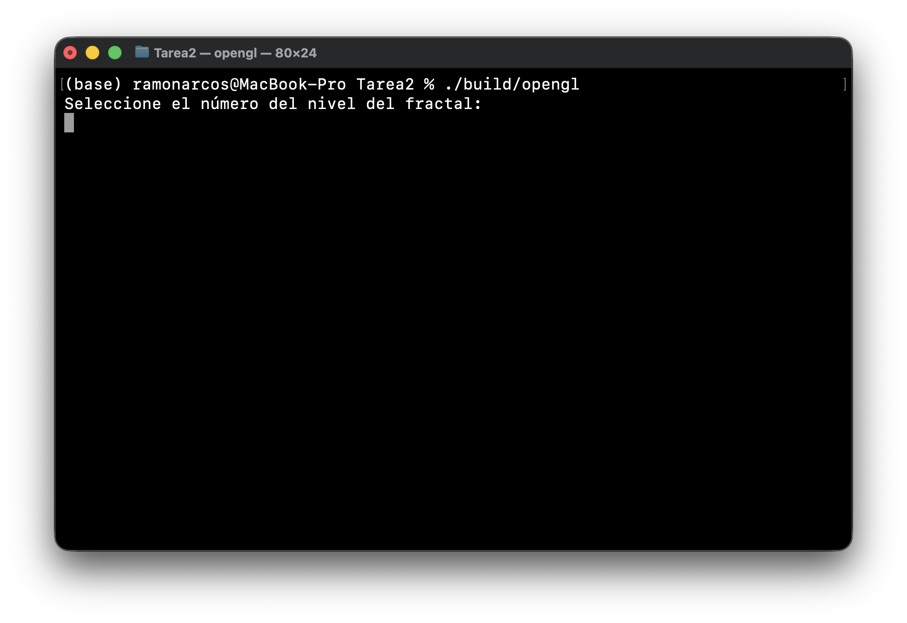
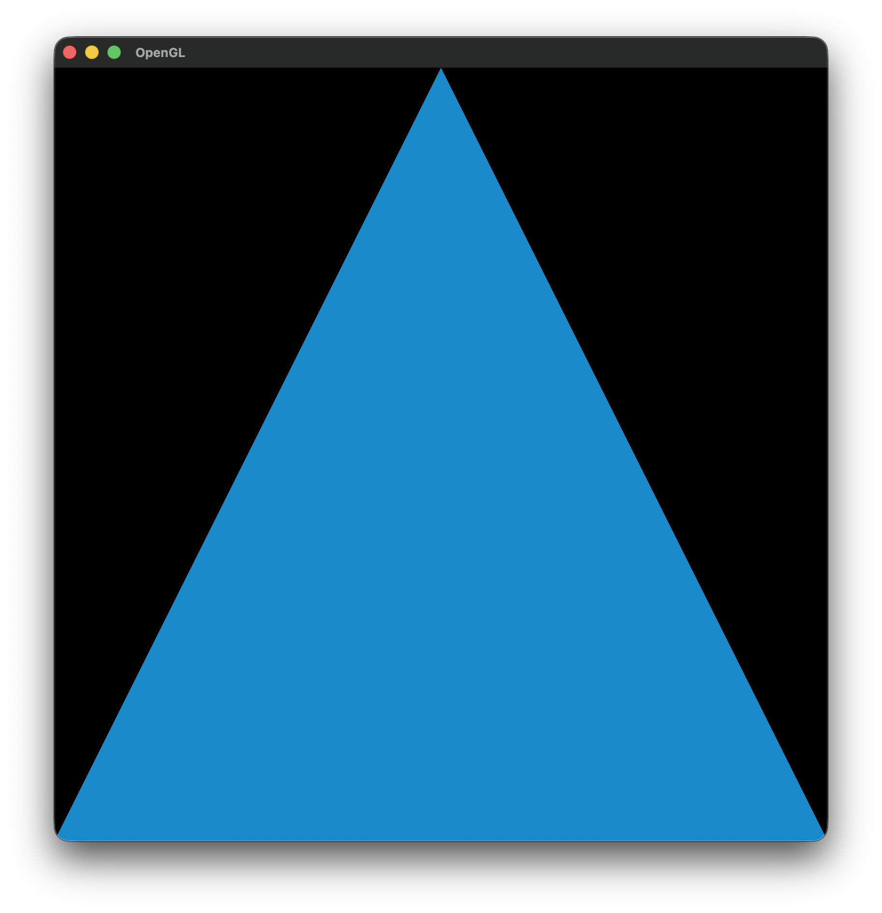
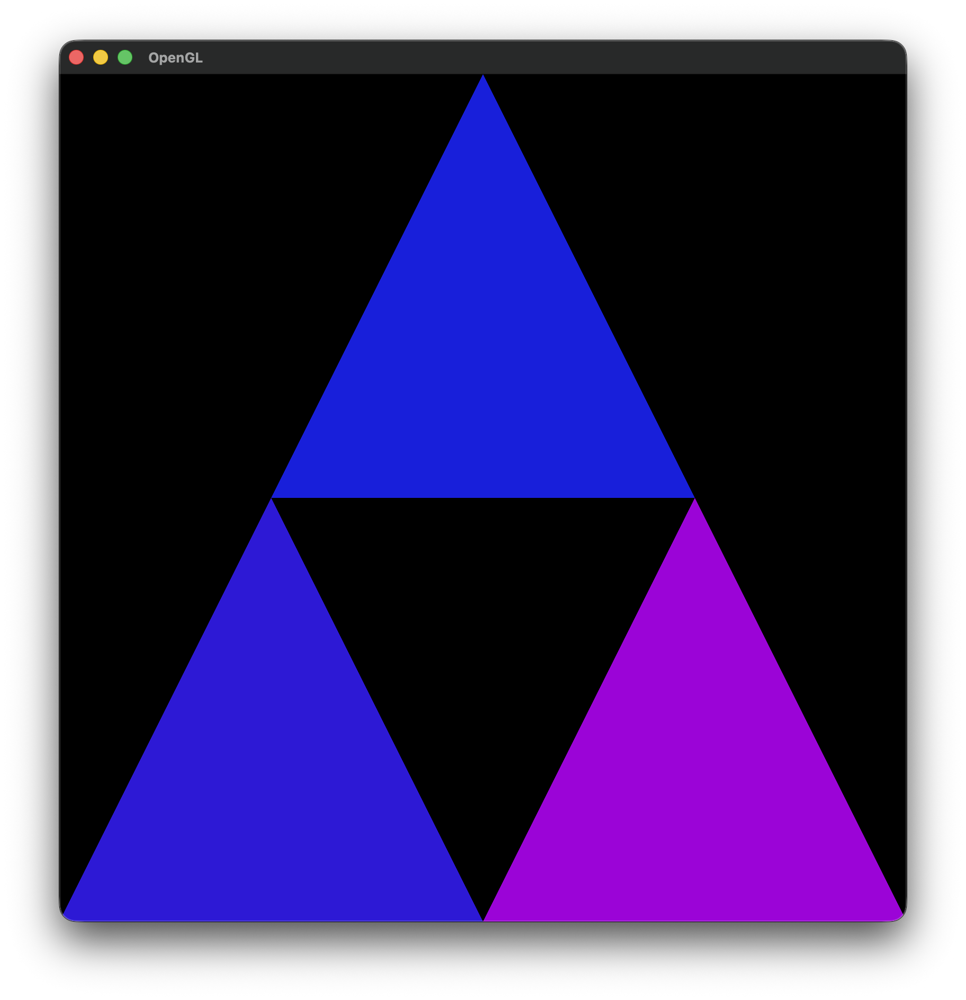
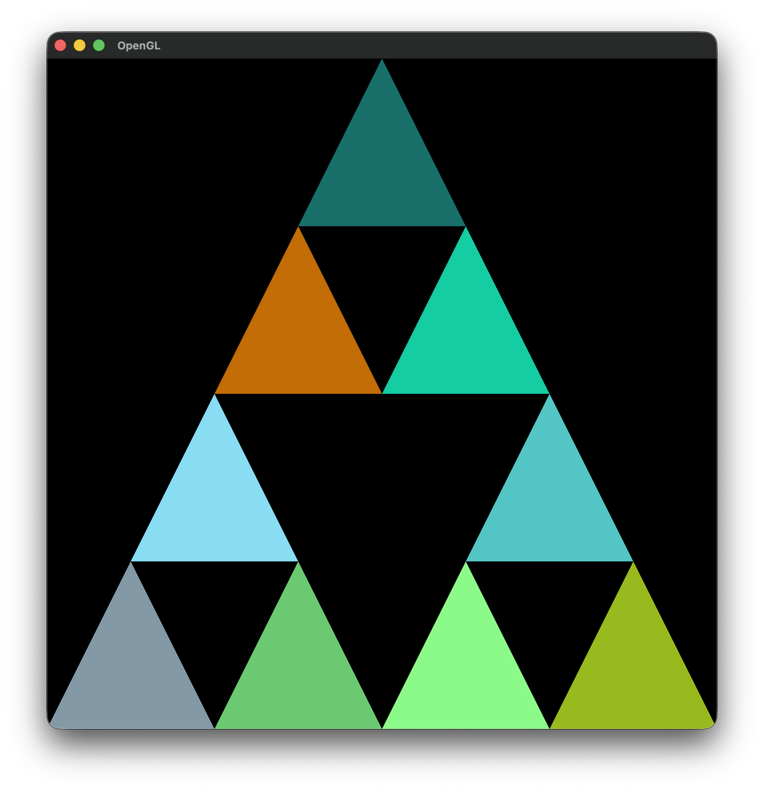
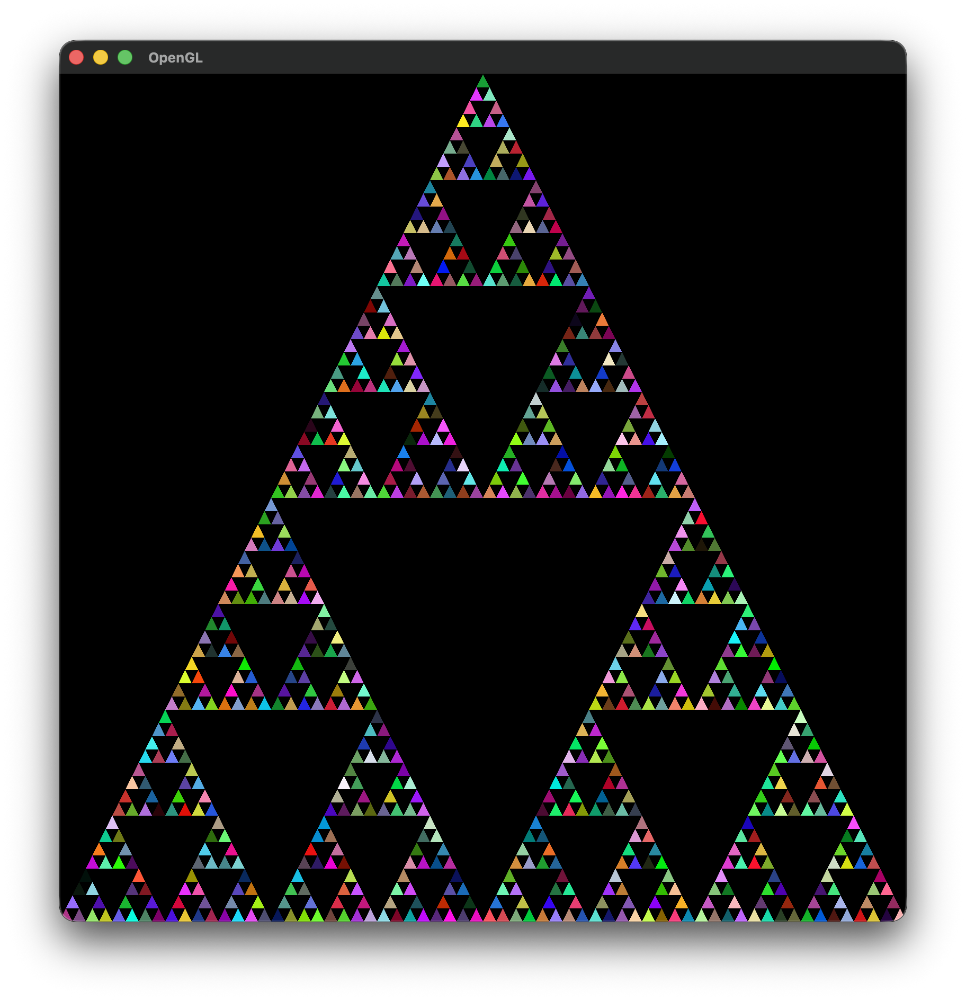

# Tarea 2: Triángulo de Sierpinski

El triángulo Sierpinski es un fractal que se puede construir a partir de cualquier triángulo. La construcción procede como sigue:

* 1.- A partir de un triángulo equilátero inicial con lados de longitud 1 por comodidad, unimos los puntos medios de cada lado y extraemos el triángulo central interno. Después de este primer paso obtenemos tres triángulos iguales, cada uno equilátero y con longitudes que son exactamente la mitad del triángulo inicial.

* 2.- Con los tres triángulos producidos por el paso anterior, procedemos de igual manera a aplicar este proceso generador en cada uno de ellos, para así obtener tres nuevos triángulos por cada uno, lo cual produce finalmente 9 triángulos equiláteros, cada uno a escala $(1/2)^2$ del inicial.

* 3.- Continuamos el proceso anterior en cada uno de los nuevos triángulos que se van generando hasta llegar al límite del proceso. La figura última es conocida como el triángulo T de Sierpinski.
[Wikipedia](https://es.wikipedia.org/wiki/Triángulo_de_Sierpinski)

El objetivo de esta tarea es poner en práctica los conocimientos básicos de **OpenGL** en dos dimensiones. Para ello, completarán la implementación para generar el T triángulo de Sierpinski.

Se provee el código base con la estructura y métodos necesarios. Únicamente deberán completar los siguientes elementos:

* **[src/main.cpp](./src/main.cpp)**:
  * La función *main()* del vertex Shader.
  * La función *main()* del fragment Shader.
  * El caso base de la función *generateSierpinski()*
  * Llenar los parámetros de la función *glVertexAttribPointer()* para los vertices.
  * Llenar los parámetros de la función *glVertexAttribPointer()* para los colores.
  * Llenar los parámetros de la función *glDrawArrays()*.

#### Los triángulos genereados *deben* tener colores aleatorios y por tanto diferentes entre si.


---

## Compilación y Ejecución

1. **Compilar el proyecto:**
   ```bash
   cmake -B build
   cmake --build build
   ```

2. **Ejecutar el programa:**
   * En Linux / macOS:
     ```bash
     ./build/tarea2
     ```
   * En Windows (PowerShell / Command Prompt):
     ```bash
     ./build/Debug/tarea2.exe
     # o ./build/tarea2.exe según el generador de CMake usado
     ```

## Resultado esperado
#### Al correr el progama se pedirá el nivel del triángulo de Sierpinski:



#### Nivel 1:


#### Nivel 2:


#### Nivel 3:


#### Nivel 7:


---

## Entrega
* **Fecha límite:** [24/09/2026 a las 23:59 hrs]
* Enviar el enlace a su repositorio de GitHub con su solución.
* Por cada semana de retraso se descontará 1 punto sobre la calificación final.

---
## Punto Extra:

Se otorgarán hasta dos puntos extras, a mi discreción, si se implementa la siguiente funcionalidad:
* Al ejecutar la aplicación se mostrará el triángulo 1 de Sierpinski.
* La aplicación detectará el input del teclado
* Al presionar la tecla de un número *t* (menor a 10) la aplicación mostrará el *t* triángulo de Sierpinski dinámicamente.

---

## Dudas
Para cualquier duda o aclaración, contactar al correo: **ramarc2@ciencias.unam.mx**
